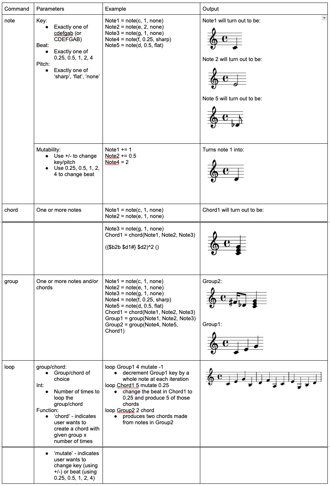

**Group 16 Project 1 Check-in 3**

Mockup Design (as used in User Study 1):\
Note: please refer to img/UserStudy1.png for a screenshot of our mockup design, syntax, example code snippets, and example outputs.\

Notes from User Study 1:\
**Findings**\
The findings of the user study highlighted the following things in each category:

Note declaration:
1. Feedback: The number for the beat was ambiguous. \
Solution: Each note’s length should be represented by the corresponding decimal number. For example, eighth note = 0.125, quarter note = 0.25, half note = 0.5. 
2. Feedback: There should be something that indicates octave.\
Solution: Additional syntax will be added to indicate this.
3. Feedback: The syntax of declaring a single note feels cumbersome.\
Solution: The declaration of a d sharp as a half note in default octave will be (d0.5#)_0

Note mutation:
1. Feedback: The note += 1 makes it seem like you are incrementing the note length and not the pitch.\
Solution: Do something like note.pitch += 1

Chords:
1. Feedback: Chords should have a limit.\
Solution: Make max 4 notes.

Groups:
1. Feedback: The word “Group” is unintuitive.\
Solution: Change to be “Sequence”

Looping:
1. Feedback: Looping is hard to read and understand.\
Solution: Change word “loop” to be “repeat”
2. Feedback: Mutation in loops is hard to understand.\
Solution: TBD

We are considering changing the syntax for the note as suggested into a simpler format. The feedback on the mutation and looping made a lot of sense as to why it would be unintuitive for a user using our DSL for the first time. We are thinking about how the user would use the loop (to be called "repeat") and mutate at the same time and design it so that it is intuitive for the user.

So far, no specific changes to the timeline has been made. At this point it does not make sense to make new tests as we are having to go back to our parse tree and think about how to restructure our grammar rules again. But we can certainly start building out test cases as this gets finalized.

**Group 16 Project 1 Check-in 2A**\
_Modular design for the software system: what is the input, output of each component? Who is responsible for each component? Do you want to be jointly responsible for some components?_

Modules:
1. Program Inputs: (Sophia, Taylor, Jeffrey)\
.txt file (input string)\
Made up of:\
a. Note: key, beat, pitch\
b. float (in 0.5s): to change beat, or add +/- to change pitch
etc.

2. Tokenizer: (Sophia, Taylor, Jeffrey)\
Input: input string\
Output: list of tokens
3. Parser: (Sophia, Taylor, Jeffrey)\
Input: List<Token>\
Output: Parse Tree
4. AST Converter (Taylor, Dave)\
Input: Parse Tree\
Output: Abstract syntax tree
5. Evaluator (backend)  (Will, Dave)\
Generate sheet music

_What is the data at each interface point? Are there invariants over the data other than the class structure?_

Data and Invariants:\
1. The data at each interface point are the notes themselves\
2. Invariants: notes cannot be null

_How will you be able to build component X independently? Can you write tests for component X independently of its dependent components?_

Early in the week of check-in 3, we will define the basic outline for the data structures. Since we will have these defined early on in our roadmap, this will allow us to work on the modules independently. We can write tests for the respective components that we are responsible for using the black box testing method.

_Who will be responsible for writing which tests, and when (will the same people write the tests as the code)?_

The same people will write the tests for the components they are responsible for.

_Are there design or other project tasks (possibly including team management), other than these components, that need to be assigned/completed?_

We will assign these tasks as needs vary. At this point, we are not fully certain of the workload of each component. Other project tasks include: weekly milestones, first user study, second user study, and the final video.

_Roadmap/timeline(s) for what should be done when, and how you will synchronise/check-in with each other to make sure progress is on-track. Talk clearly with your team members about your expectations for communication and progress, and what you will do as a team if someone falls behind._

Check-in 3 (Feb. 2):\
Figure out what an AST actually is and how it works\
User study 1\
Use feedback to iterate on grammar rules\
Test framework implemented\
Write stubs for data structures used between modules (mainly parse tree, AST, and output).

Feb. 5:\
Code look finalized (grammar rules not fully implemented in ANTLR)\
Have MVP done - simple implementation of note from input all the way to sheet music output

Check-in 4 (Feb 9)\
Status update on overall project\
Refine timeline if necessary\
Start planning for user study #1\
Further implementation of grammar rules and features

Check-in 5 (Feb 16)\
Completed user study #1\
Mostly completed end to end DSL

Project 1 Deadline (Feb 26):\
Completed video\
Final improvements

_Summary of progress so far._

Defined roles and responsibilities.\
Outlined roadmap and internal timeline for team.

**Group 16 Project 1 Check-in 1**\
Members: Jeffrey Chow, Dave Borrel, Taylor Foster, William Gumboc, Sophia Kim

_What is the high-level purpose of your DSL? What kind of users is it aimed at? What will it enable users to do?_

The high-level purpose of our DSL is to create a language that makes composing music easier for users. Our targeted users include composers, musicians, and music enthusiasts. With this DSL, users will be able to compose music and generate sheet music in the end. When it comes to music, there is a lot of duplication of rhythm, repetition in music patterns, and structured compositions of notes. As such, this DSL will allow users to compose more efficiently.

_What are the 2-3 rich features of your DSL? A rich feature should be more complex than a choice in a set (e.g., the ability to choose between colours for a title is not a “rich” feature). What customisation will each feature enable? Which features can be combined to interact in useful or creative ways?_

**Feature 1: Tuples**\
Users can use tuples as a feature where they can define each note’s pitch, length, and modifier. For example:

note1 = (C, eighth, sharp);\
// note1 is an eighth note set to C#

note1[0] -= 1\
// note1[0] modifies the note assigned to note1 (first in the tuple) and sets the note down by 1, which would become D#. Values can be incremented
and decremented from 0.5 (i.e. from C# to C is note1[0] -= 0.5)

**Feature 2: Loops**\
Users can use loops as a feature that groups different notes together and loop through them x times for repetition. For example:

// groups note1, note2, note3, note4, note5\
group_fun = (note1, note2, note3, note4, note5)

// loops through group_fun 3 times\
loop group_fun times 3;

**Feature 3: Functions**\
Users can use different functions that can manipulate the notes, such as creating chords, ties, and controlling volume. For example:

// note1, note2, and note3 will play at the same time\
chord1 = chord(note1, note2, note3)

// note4, note5, note6 will be connected with a tie\
tie1 = tie(note4, note5, note6)

// sets bars 1 to 4 a volume of f, meaning “forte”\
// other volume options would be (quietest -> loudest):\
// ppp (triple piano), pp (pianissimo), p (piano), mp (mezzo piano), mf (mezzo forte), f (forte), ff (fortissimo), fff (triple forte)\
make volume of bar 1 to 4 to be f;

**Feature 4: Conditionals**\
Users can write conditions for each note or group of notes. This allows them to customize notes if it passes a condition that the user sets. For example:

// this code will reduce each notes’ volume by 1\
//     if the number of bars that group_fun encompasses is greater than 4\
if (group_fun.bar greater than 4) {\
for each note in group_fun {\
note.volume -= 1\
}\
}

// and then repeats the group of notes in group_fun 9 times\
loop group_fun times 9;

**Feature 5: Mutability**\
Users can mutate notes through each parameter. This allows for manipulating sets or subsets of notes after its’ been declared.

// this code will add notes in group_fun 3 times, and each time, the notes will decrement by 1 pitch
for i in loop 3:\
add(group_fun)\
group_fun = group_fun.all(-1)

_Example snippets of your DSL that illustrate at least each rich feature, and any interesting interaction between those._

note1 = (B, quarter, none);\
note2 = (C, quarter, none);\
note3 = (d, quarter, none);

groupA = tie(note1, note2, note3)

loop n in groupA each (0, 2) note -1 2\
Example syntax: loop [variable] in [set of tuples] [each/all] [optional index(es) if 'each'] [note/beat] [pitch change] [volume change]

_Feedback from TA discussion._\
Our TA provided positive feedback to this idea and gave us her approval. Some feedback we received included having the ability to manipulate subsets of notes, which we’ve taken into account by indexing into the sets.

